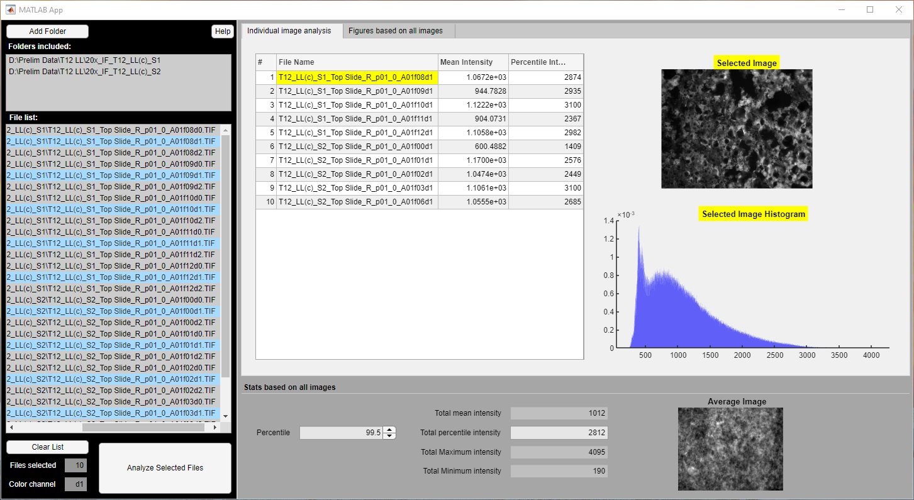
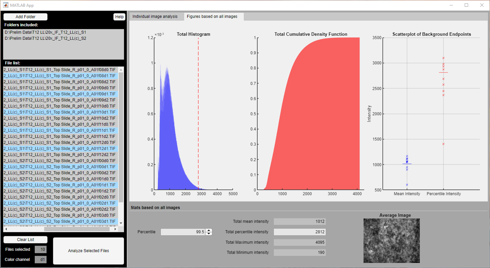

# Fluorescent microscopy signal analysis
This MATLAB app analyzes folders containing color channels as d0, d1, d2, d3...

* **AverageHistogramAnalysis.mlapp** requires MATLAB 2020b+ 
* **InstallAHA_web.exe** does not require a MATLAB license

